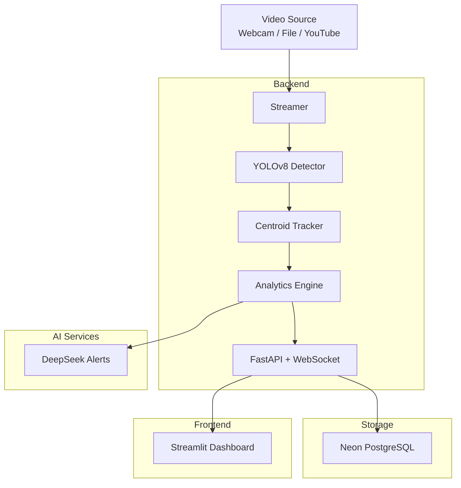

# 🏙️ CitySight — Smart City Vision Analytics

**Real-time computer vision for smart city monitoring.** Detect, track, and count vehicles and pedestrians from any video feed — with an interactive analytics dashboard, PostgreSQL event logging, and AI-powered anomaly alerts.

[](https://python.org)
[](https://fastapi.tiangolo.com)
[](https://streamlit.io)
[](https://github.com/ultralytics/ultralytics)
[](https://opencv.org)
[](https://neon.tech)
[](https://deepseek.com)
[](LICENSE)

---

## 📐 Architecture



## ✨ Features

| Feature | Description |
|---------|-------------|
| 🚗 **Object Detection** | YOLOv8n/s detects cars, trucks, buses, motorcycles, bicycles, and pedestrians |
| 🏷️ **Multi-Object Tracking** | Centroid + IoU tracker assigns unique IDs and tracks across frames |
| 📊 **Traffic Analytics** | Vehicle counts per type, speed estimation (km/h), vehicle type breakdown |
| 👥 **Crowd Density** | Real-time pedestrian density classification (low → medium → high) |
| 🔥 **Activity Heatmap** | Exponential-decay heatmap of object positions over the last N frames |
| ⏱️ **Dwell Time** | Track how long each object stays in the field of view |
| 📡 **Real-time Streaming** | WebSocket pushes annotated frames + analytics to the dashboard every ~100ms |
| 💾 **Event Logging** | Periodic snapshots and high-density alerts stored in Neon PostgreSQL |
| 🤖 **Anomaly Alerts** | DeepSeek LLM generates natural-language alerts when metrics deviate from baselines |
| 📈 **Interactive Dashboard** | Streamlit app with live video, Plotly charts, heatmap, and event log |

## 🚀 Quick Start

### Prerequisites
- Python 3.11+
- Webcam **or** a sample video file (see `sample_video/README.md`)

### 1. Clone & setup

```bash
cd citysight

# Create virtual environment
python -m venv .venv
source .venv/bin/activate  # Windows: .venv\Scripts\activate

# Install dependencies
pip install -r backend/requirements.txt
pip install -r frontend/requirements.txt
```

### 2. Configure environment

```bash
cp .env.example .env
# Edit .env — at minimum set VIDEO_SOURCE
```

The system works **out of the box** with defaults:
- **Synthetic mode**: If no camera/file is available, a simulated intersection is auto-generated
- **No database needed**: Event logging is optional — just leave `DATABASE_URL` empty
- **No DeepSeek key needed**: Falls back to rule-based anomaly detection

### 3. Run

**Option A — Windows batch (easiest):**
```bash
run.bat
```

**Option B — Manual (two terminals):**
```bash
# Terminal 1: Backend
python -m backend.main

# Terminal 2: Dashboard
streamlit run frontend/app.py
```

### 4. Open dashboard

- **Dashboard**: http://localhost:8501
- **API Docs**: http://localhost:8000/docs
- **WebSocket**: ws://localhost:8000/ws

> ⚡ First run downloads `yolov8n.pt` (~6 MB) automatically from Ultralytics.

## 🔧 Environment Variables

| Variable | Default | Description |
|----------|---------|-------------|
| `YOLO_MODEL` | `yolov8n.pt` | YOLO model (nano/small) |
| `VIDEO_SOURCE` | `0` | Webcam index, file path, or YouTube URL |
| `TARGET_FPS` | `15` | Processing frame rate |
| `CONFIDENCE_THRESHOLD` | `0.4` | Minimum detection confidence |
| `PIXELS_PER_METER` | `120.0` | Calibration for speed estimation |
| `DATABASE_URL` | *(empty)* | Neon PostgreSQL connection string |
| `DEEPSEEK_API_KEY` | *(empty)* | DeepSeek API key for AI alerts |
| `PORT` | `8000` | Backend server port |

## 📁 Project Structure

```
citysight/
├── backend/
│   ├── main.py           # FastAPI + WebSocket server
│   ├── config.py         # Environment-based configuration
│   ├── detector.py       # YOLOv8 detection + centroid tracker
│   ├── analytics.py      # Counting, speed, density, heatmaps
│   ├── streamer.py       # Video capture → processing → broadcast
│   ├── database.py       # Neon PostgreSQL event logging
│   ├── alerting.py       # DeepSeek anomaly alerts
│   └── models.py         # Pydantic data models
├── frontend/
│   ├── app.py            # Streamlit dashboard
│   └── requirements.txt
├── sample_video/
│   └── README.md         # Instructions to download test video
├── .env.example
└── README.md
```

## 🎯 Target Use Cases

Built with **UAE Smart City roles** in mind:
- **Smart Dubai** — City-wide monitoring and analytics
- **RTA (Roads & Transport Authority)** — Traffic flow analysis
- **DEWA** — Smart infrastructure monitoring

Showcases skills in: **computer vision, edge AI, real-time streaming, data engineering, and interactive dashboards**.

## 📊 Dashboard Preview

<!-- Screenshots -->
> *Screenshot placeholders — add your own after running:*
> - `docs/screenshots/dashboard.png`
> - `docs/screenshots/heatmap.png`
> - `docs/screenshots/alerts.png`

## 🛠️ Tech Stack

- **Detection**: [Ultralytics YOLOv8](https://github.com/ultralytics/ultralytics) (pre-trained on COCO)
- **Tracking**: Custom centroid + IoU tracker (SORT-inspired)
- **Backend**: FastAPI + WebSockets (async)
- **Frontend**: Streamlit + Plotly
- **Database**: Neon PostgreSQL (serverless, edge-friendly)
- **AI Alerts**: DeepSeek Chat API
- **Vision**: OpenCV + NumPy

## 📝 License

MIT — see [LICENSE](LICENSE) file.

---

*Built for the UAE AI job market — computer vision + edge AI roles.*
